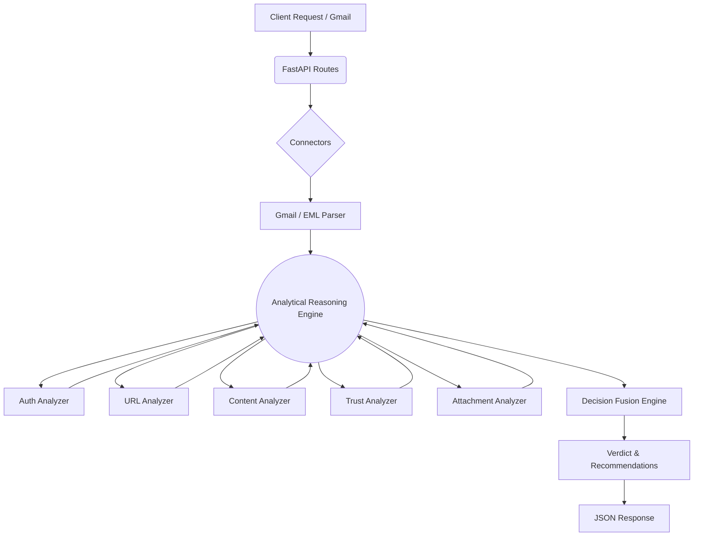

# TunaMail 🐟

TunaMail is an intelligent, AI-powered email threat analysis platform. Built as a fast and modular REST API, it connects seamlessly to Gmail to parse and analyze inbound emails, flagging sophisticated phishing attempts, malicious attachments, and social engineering attacks using a powerful multi-layered heuristic engine.

---

## Features

- 🔗 **Direct Gmail Integration**: Authenticate securely via Google OAuth2 to scan live inboxes.
- 🎯 **5-Tier Risk System**: Classifies emails into `SAFE`, `LOW RISK`, `SUSPICIOUS`, `HIGH RISK`, or `PHISHING`.
- 🛡️ **Authentication Validation**: Strict checking of SPF, DKIM, and DMARC headers.
- 🌐 **URL Threat Detection**: Scans for embedded IP addresses, URL shorteners, and suspicious domain patterns.
- 🧠 **Content Heuristics**: Detects urgency, credential harvesting, financial requests, threat language, and impersonation.
- 📎 **Attachment Analysis**: Identifies and flags dangerous executable files (`.exe`, `.msi`), scripts (`.vbs`, `.ps1`), and macro-enabled documents.
- 🏢 **Dynamic Domain Trust**: A dedicated Trust Analyzer that intelligently recognizes legitimate domains to prevent false positives.

---

## Architecture

TunaMail uses a modular pipeline where specialized analyzers evaluate distinct components of an email, fused together by the Analytical Reasoning Engine (ARE) and finalized by the Decision Fusion Engine.



---

## Installation

1. **Clone the repository:**
   ```bash
   git clone https://github.com/your-org/TunaMail.git
   cd TunaMail
   ```

2. **Create and activate a virtual environment:**
   ```bash
   python -m venv .venv
   # Windows
   .venv\Scripts\activate
   # macOS/Linux
   source .venv/bin/activate
   ```

3. **Install dependencies:**
   ```bash
   pip install -r requirements.txt
   ```

---

## Gmail OAuth Setup

To enable the Gmail integration, you must provide Google Cloud credentials:

1. Navigate to the [Google Cloud Console](https://console.cloud.google.com/).
2. Create a new Project and enable the **Gmail API**.
3. Configure the **OAuth consent screen**.
4. Navigate to **Credentials** -> **Create Credentials** -> **OAuth client ID**.
5. Choose **Desktop app** as the application type.
6. Download the resulting JSON file and rename it to `client_secret.json`.
7. Place `client_secret.json` in the root directory of the TunaMail project.

---

## Configuration

TunaMail relies on a modular `src/config/scoring.py` file to define threat weights. You can adjust the scoring multipliers for various heuristic triggers (e.g., URL shorteners, threat language) directly in this file to tune the engine to your organization's risk tolerance.

To run the API server locally:
```bash
python -m uvicorn src.api.app:app --reload
```

---

## API Endpoints

### System
- **`GET /health`** - Check API health status.

### Gmail Connectors
- **`GET /gmail/login`** - Initiates the OAuth2 flow to connect a Gmail account.
- **`GET /gmail/callback`** - OAuth2 redirect handler.
- **`GET /gmail/messages?max_results=10`** - Fetch and list recent emails from the authenticated inbox.
- **`GET /gmail/message/{message_id}`** - Fetch, parse, and run a full threat analysis on a specific email.

### Manual Upload
- **`POST /analyze`** - Upload a raw `.eml` file for direct pipeline analysis without connecting an inbox.

---

## Example Output

When querying `/gmail/message/{message_id}`, the API returns a structured, nested JSON response detailing the evidence and the final verdict:

```json
{
  "id": "18a8f1b2c3d4e5f6",
  "subject": "Action Required: Update Your Account",
  "from": "Admin <admin@microsoft-update-security.com>",
  "analysis": {
    "authentication": {
      "spf": "softfail",
      "dkim": "fail",
      "dmarc": "fail",
      "trust_score": 0,
      "issues": [
        "SPF check did not pass (result: softfail)",
        "DKIM check did not pass (result: fail)"
      ]
    },
    "content": {
      "risk_score": 45,
      "evidence": [
        "Urgency detected",
        "Credential request detected"
      ]
    },
    "url": {
      "risk_score": 15,
      "evidence": [
        "URL shortener detected: bit.ly"
      ]
    },
    "trust": {
      "trust_score": 0,
      "evidence": []
    },
    "reasoning": {
      "risk_score": 75,
      "confidence_score": 95,
      "evidence": {
        "network": ["URL shortener detected: bit.ly"],
        "behavioral": ["Urgency detected", "Credential request detected"],
        "technical": ["SPF check did not pass (result: softfail)", "DKIM check did not pass (result: fail)"]
      }
    },
    "decision": {
      "verdict": "PHISHING",
      "recommendations": [
        "Do not click any links.",
        "Delete immediately.",
        "Report to security team."
      ]
    }
  }
}
```

---

## Future Roadmap

- [ ] **Machine Learning Integration**: Upgrade the `ContentAnalyzer` from keyword heuristics to a robust NLP classification model (e.g., BERT) to detect semantic social engineering.
- [ ] **External Threat Intel**: Integrate APIs like VirusTotal to sandbox attachments and scan extracted URLs in real-time.
- [ ] **Web Dashboard**: Build a React-based frontend GUI for security teams to visualize verdicts and configure scoring matrices.
- [ ] **Real-time Webhooks**: Subscribe to Gmail push notifications for immediate, automated inbox scanning.
